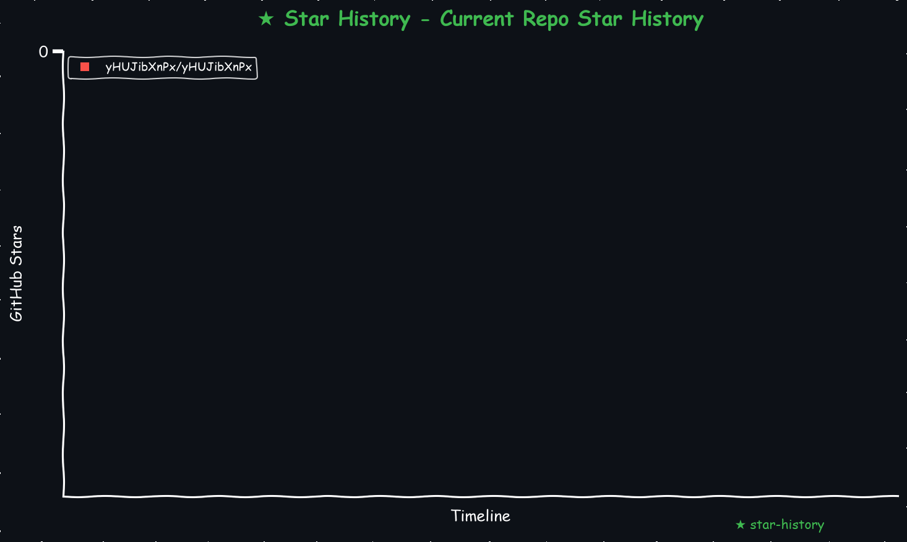
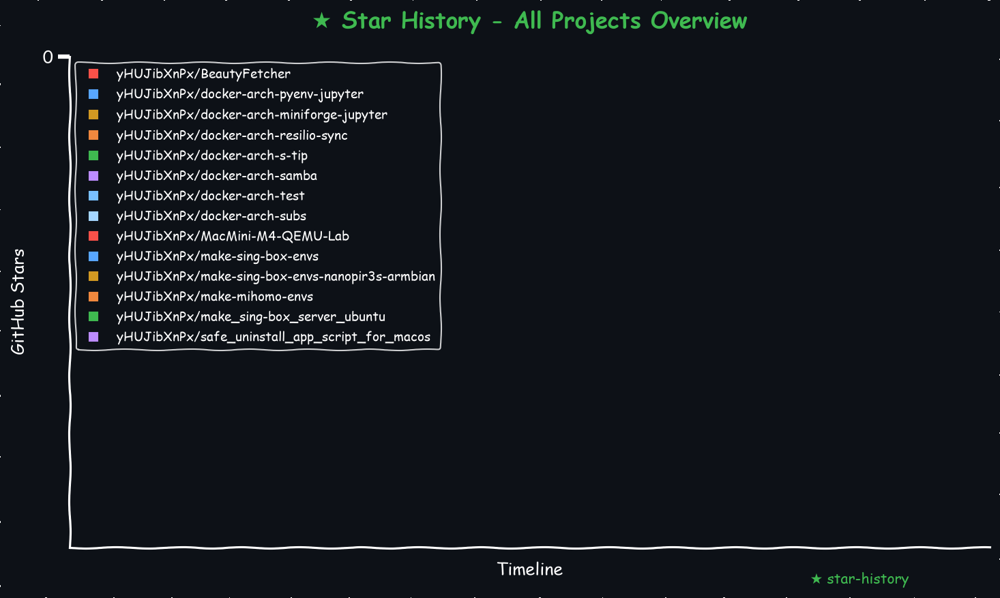

# Hi there, I'm yHUJibXnPx
这里是我的项目控制台，实时展示项目健康状态。

    

<!-- START_STAR_HISTORY_SELF -->

<!-- END_STAR_HISTORY_SELF -->

### 目录结构
    .
    ├── LICENSE                                     # TIM 协议  
    ├── make_readme.py                              # 创建 README.md 脚本  
    ├── test_mock_chart.py                          # 模拟 星星统计 脚本  
    ├── requestment.txt                             # Python脚本所需依赖  
    ├── make_star_chart.py                          # 生成 星星统计 脚本  
    └── README.md                                   # 项目全景看板  

### General Repositories
<!-- START_STAR_HISTORY_ALL -->

<!-- END_STAR_HISTORY_ALL -->

| 项目名称 | Visits | Stars | Forks | Issues | Last Commit | Packages |
| :--- | :---: | :---: | :---: | :---: | :---: | :--- |
| [**BeautyFetcher**](https://github.com/yHUJibXnPx/BeautyFetcher) |  |  |  |  |  |   |
| [**docker-arch-pyenv-jupyter**](https://github.com/yHUJibXnPx/docker-arch-pyenv-jupyter) |  |  |  |  |  |  [**docker-arch-pyenv-jupyter**](https://github.com/yHUJibXnPx/docker-arch-pyenv-jupyter/pkgs/container/docker-arch-pyenv-jupyter) |
| [**docker-arch-miniforge-jupyter**](https://github.com/yHUJibXnPx/docker-arch-miniforge-jupyter) |  |  |  |  |  |  [**docker-arch-miniforge-jupyter**](https://github.com/yHUJibXnPx/docker-arch-miniforge-jupyter/pkgs/container/docker-arch-miniforge-jupyter) |
| [**docker-arch-resilio-sync**](https://github.com/yHUJibXnPx/docker-arch-resilio-sync) |  |  |  |  |  |  [**docker-arch-resilio-sync**](https://github.com/yHUJibXnPx/docker-arch-resilio-sync/pkgs/container/docker-arch-resilio-sync) |
| [**docker-arch-s-tip**](https://github.com/yHUJibXnPx/docker-arch-s-tip) |  |  |  |  |  |  [**docker-arch-s-tip**](https://github.com/yHUJibXnPx/docker-arch-s-tip/pkgs/container/docker-arch-s-tip) |
| [**docker-arch-samba**](https://github.com/yHUJibXnPx/docker-arch-samba) |  |  |  |  |  |  [**docker-arch-samba**](https://github.com/yHUJibXnPx/docker-arch-samba/pkgs/container/docker-arch-samba) |
| [**docker-arch-test**](https://github.com/yHUJibXnPx/docker-arch-test) |  |  |  |  |  |  [**docker-arch-test**](https://github.com/yHUJibXnPx/docker-arch-test/pkgs/container/docker-arch-test) |
| [**docker-arch-subs**](https://github.com/yHUJibXnPx/docker-arch-subs) |  |  |  |  |  |   |
| [**MacMini-M4-QEMU-Lab**](https://github.com/yHUJibXnPx/MacMini-M4-QEMU-Lab) |  |  |  |  |  |   |
| [**make-sing-box-envs**](https://github.com/yHUJibXnPx/make-sing-box-envs) |  |  |  |  |  |   |
| [**make-sing-box-envs-nanopir3s-armbian**](https://github.com/yHUJibXnPx/make-sing-box-envs-nanopir3s-armbian) |  |  |  |  |  |   |
| [**make-mihomo-envs**](https://github.com/yHUJibXnPx/make-mihomo-envs) |  |  |  |  |  |   |
| [**make_sing-box_server_ubuntu**](https://github.com/yHUJibXnPx/make_sing-box_server_ubuntu) |  |  |  |  |  |   |
| [**safe_uninstall_app_script_for_macos**](https://github.com/yHUJibXnPx/safe_uninstall_app_script_for_macos) |  |  |  |  |  |   |

### Gist Knowledge Base

| 文档标题 | Visits | Stars | Last Commit |
| :--- | :---: | :---: | :---: |

[查看更多 Gists...](https://gist.github.com/yHUJibXnPx)